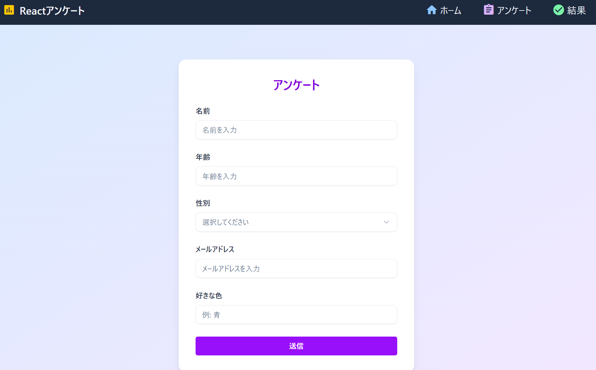

# 概要
このリポジトリは、**Vite + React + React Router DOM + Tailwind CSS + ShadCN UI** を使用した、アンケートフォームアプリのテンプレートです。
モダンなフロントエンド開発スタックにより、**簡潔なUI構築** と **柔軟なルーティング** を実現します。

## 🚀 使用技術スタック

- [React](https://reactjs.org/) — UI開発ライブラリ
- [Vite](https://vitejs.dev/) — 高速ビルドツール
- [React Router DOM](https://reactrouter.com/) — ルーティングライブラリ
- [Tailwind CSS](https://tailwindcss.com/) — ユーティリティファーストなCSSフレームワーク
- [ShadCN UI](https://ui.shadcn.com/) — アクセシブルで洗練されたUIコンポーネント
- [Material Icons](https://fonts.google.com/icons) — アイコンセット（

## 🖼️ UIサンプル

